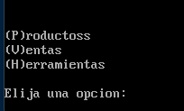
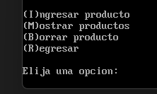
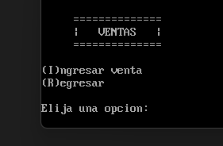
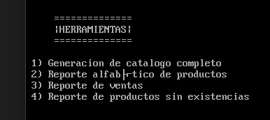

# ACE1-23VJ0778202100154PRA2
## Practica 2 - Arqui1
___

Sergio André Lima Corado - 202100154

## Manual de Usuario

## Menú Principal

En este menú se presentan las opciones de **Productos**, **Ventas**, **Reportes** y **Salir**. Para seleccionar una opción se debe ingresar la tecla de la opción, es decir la primera letra encerrada en paréntesis. El programa reconocerá la opción y la ejecutará.

## Menú Productos

En este menú se presentan las opciones de **Agregar Producto**, **Borrar Producto**, **Mostrar Productos** y **Regresar**. Para seleccionar una opción se debe ingresar la tecla de la opción, es decir la primera letra encerrada en paréntesis. El programa reconocerá la opción y la ejecutará.

### Agregar Producto

Esta opción permite agregar un producto al archivo de productos. Para ello se debe ingresar el código del producto, la descripción del producto y el precio del producto. El código del producto debe ser un número de 4 dígitos, las unidades y el precio del producto debe ser un número de 2 dígitos. Si el producto ya existe, el programa mostrará un mensaje de error y volverá al menú de productos.

Además se deben de respetar algunas REGEX al ingresar los datos. 

| Campo | Regex |
| ----- | ----- |
| Código | [A-Z 0-9]|
| Descripción | [A-Z 0-9 , . !]|
| Unidades | [0-9]|
| Precio | [0-9]|

Los productos son agregados al archivo PROD.BIN. El archivo PROD.BIN es un archivo binario que contiene los productos.

### Borrar Producto

Esta opción permite borrar un producto del archivo de productos. Para ello se debe ingresar el código del producto. El código del producto debe ser máximo un código de 4 dígitos. Si el producto no existe, el programa mostrará un mensaje de error y volverá al menú de productos.

De ser exitoso el borrado del producto, el programa mostrará un mensaje de éxito y volverá al menú de productos.

### Mostrar Productos

Esta opción permite mostrar todos los productos del archivo de productos. El programa empezará a desplegar los productos en grupos de 5. Para continuar se debe presionar la tecla **Enter**. Si no hay más productos, el programa volverá al menú de productos.

Caso contrario, si desea salir de la visualización de productos, se debe presionar la tecla **q**. El programa volverá al menú de productos.

## Menú Ventas

El menú de ventas solamente cuenta con la opción de **Realizar Venta**. Para seleccionar una opción se debe ingresar la tecla de la opción, es decir la primera letra encerrada en paréntesis. El programa reconocerá la opción y la ejecutará.	

Además cuenta con la opción de **Regresar** que redirige al menú principal.

### Realizar Venta

Esta opción permite realizar una venta. Para ello se debe ingresar el código del producto y la cantidad de unidades que se desea vender. El código del producto debe ser máximo un código de 4 dígitos. Si el producto no existe, el programa mostrará un mensaje de error y volverá al menú de ventas.

Posteriormente consultará las unidades que desea vender. Si el producto no tiene suficientes unidades, el programa mostrará un mensaje de error y volverá al menú de ventas. De ser exitoso el proceso de venta, el programa mostrará un mensaje de éxito y volverá al menú de ventas.

## Menú Herramientas

La sección de herramientas contendrá una serie de utilidades cuya función principal será la generación de diversos reportes.

___
___

## Manual Técnico

## Assembler

### ¿Qué es Assembler? 

Assembler es un lenguaje de programación de bajo nivel, el cual es un lenguaje de programación que proporciona un fuerte nivel de abstracción del funcionamiento y la estructura de una computadora.

Assembler es un lenguaje de programación que permite escribir programas informáticos utilizando mnemónicos para cada instrucción, con el fin de realizar operaciones de bajo nivel, como el manejo directo del hardware, y las rutinas de control de la máquina.

### ¿Qué es MASM 611?

MASM 611 es un ensamblador de 16 bits para la familia de procesadores x86. Fue desarrollado por Microsoft. El nombre MASM significa Microsoft Macro Assembler (Ensamblador de macros de Microsoft).

### ¿Qué es DOSBox?

DOSBox es un emulador de DOS que utiliza la biblioteca SDL. DOSBox emula una CPU Intel x86, un chip de sonido, gráficos VGA, un disco duro y un conjunto de dispositivos periféricos comunes.

## Métodos Utilizados

### Escribir Producto en Archivo

~~~
escribir_producto: ; ESCRIBIR EL PRODUCTO EN EL ARCHIVO
		mov CX, 26
		mov DX, offset cod_prod
		mov AH, 40
		int 21
        ; ESCRIBO LOS OTROS DOS
        mov CX, 0004
		mov DX, offset num_precio
		mov AH, 40
		int 21
		;; limpiar todos los campos
		mov DI, offset cod_prod
		mov CX, 2a
		call memset
		; CERRAR EL ARCHIVO
		mov ah, 3e
		int 21
		mPrint nueva_lin
		jmp menu_productos
~~~

### Sobreescribir Producto en Archivo
~~~
; GUARDAMOS HANDLE
mov [handle_productos], AX
; OBTENER HANDLE
mov BX, [handle_productos]
mov DX, 0000
mov [puntero_temp], DX

ciclo_encontrar_productoVacio:
    int 03
    mov bx, [handle_productos]
    mov cx, 2a
    mov dx, offset prod_temp
    moV AH, 3f
    int 21
    cmp AX, 0000   ;; se acaba cuando el archivo se termina
    je avanzar_punteroAlFinal
    mov DX, [puntero_temp]
    add DX, 2a
    mov [puntero_temp], DX
    ;;; verificar si es producto no válido
    mov AL, 00
    cmp [prod_temp], AL
    je avanzar_puntero
    jmp ciclo_encontrar_productoVacio
avanzar_puntero:
    mov DX, [puntero_temp]
    sub DX, 2a
    mov CX, 0000
    mov BX, [handle_productos]
    mov AL, 00
    mov AH, 42
    int 21
    jmp escribir_producto
;;; puntero posicionado
;;; Escribir Producto en Archivo (escribir_producto)
~~~

### Buscar Producto

~~~
buscar_producto:
    mov DI, offset prod_temp
    mov CX, 2a
    call memset
    mov bx, [handle_productos]
    mov cx, 2a
    mov dx, offset prod_temp
    moV AH, 3f
    int 21		
    cmp AX, 0000   ;; no encontró si el archivo se termina
    je finalizar_buscar_producto		
    ;;; Si está vacío o fragmentado
    mov AL, 00
    cmp [prod_temp], AL
    je buscar_producto
    ;;; verificar el código
    mov SI, offset prod_temp
    mov DI, offset cod_prod
    mov CX, 0005
    call cadenas_iguales
    ;;;; <<
    cmp DL, 0ff
    je producto_encontrado
    jmp buscar_producto
producto_encontrado:
    mov dl, 0ff
finalizar_buscar_producto:
    mov bx, [handle_productos]
    mov ah, 3e ; cerrar archivo
    int 21
cmp DL, 0ff
; si ya existe el producto
je producto_ya_existe
~~~

### Eliminar Producto

~~~
borrar_encontrado:
    mov DX, [puntero_temp]
    sub DX, 2a
    mov CX, 0000
    mov BX, [handle_productos]
    mov AL, 00
    mov AH, 42
    int 21
    ;;; puntero posicionado
    mov CX, 2a
    mov DX, offset ceros
    mov AH, 40
    int 21
    mPrint separador_comun
    mPrint producto_eliminado
    mPrint nueva_lin
    mPrint nueva_lin
    jmp finalizar_borrar
~~~

### Modificar Producto

~~~
modificar_producto:
    mov al, 02
    mov dx, offset arch_productos
    mov ah, 3dh
    int 21h
    mov [handle_productos], ax
    ;
    ciclo_modificar_producto:
        mov bx, [handle_productos]
        mov cx, 26h
        mov dx, offset codigoVenta
        mov ah, 3f
        int 21h
        ;
        ; Puntero en el precio del producto
        mov bx, [handle_productos]
        mov cx, 04h
        mov dx, offset num_precioVenta
        mov ah, 3f
        int 21h
        ;
        ; Comparar si se termino el archivo para finalizar venta 
        ; (o lanzar mensaje de que no encontró)
        cmp AX, 0000   
        je finalizar_ventas
        ;
        ; Operaciones de puntero
        mov dx, [puntero_temp]
        add dx, 2ah
        mov [puntero_temp], dx
        ; verificar si es producto válido
        mov AL, 00
        cmp [codigoVenta], AL
        je ciclo_encontrar_producto_ventas
        ; verificar el código con el código ingresado
        mov SI, offset codigoVentaTemporal
        mov DI, offset codigoVenta
        mov CX, 0005
        ;; Verificar las cadenas
        call cadenas_iguales
        cmp DL, 0ff
        je restar_existencias_producto
        jmp ciclo_modificar_producto

        restar_existencias_producto:
        ; Posicionar puntero para el offset de la interrupcion
        mov dx, [puntero_temp]
        sub dx, 2ah
        mov cx, 0000
        ; Mover el puntero
        mov bx, [handle_productos]
        mov al, 00
        mov ah, 42h
        int 21h
        ; Restar las unidades vendidas
        mov ax, [num_unidadesVenta]
        sub ax, [num_cantidad]
        mov [num_unidadesVenta], ax
        ; Escribir el nuevo contenido con las unidades restadas
        mov cx, 2ah
        mov dx, offset codigoVenta
        mov ah, 40h
        int 21h
        ; Cerrar el archivo para guardar cambios
        mov bx, [handle_productos]
        mov ah, 3eh
        int 21h
        ;; CALCULAR MONTO
        ; IMPRIMIR MONTO
        mPrint nueva_lin
        mPrint prompt_monto	
        ;
        ; MULTIPLICACION
        mov AX,  [num_precioVenta]
        mul num_cantidad ; resultado en AX
        mov [num_monto], AX ; guardo el monto
        ;
        mov AX, [num_monto]
        call numAcadena ;; [numero] tengo la cadena convertida
        mov BX, 0001
        mov CX, 0005
        ;
        mov DX, offset numero
        mov AH, 40
        int 21
        ;
        ; IMPRIMIR MONTO TOTAL
        mPrint nueva_lin
        mPrint prompt_monto_total
        ; SUMA DEL MONTO TOTAL
        mov DI, [num_monto]
        add [num_monto_total], DI	
        ;
        mov AX, [num_monto_total]
        call numAcadena ;; [numero] tengo la cadena convertida
        ;
        mov BX, 0001
        mov CX, 0005
        mov DX, offset numero
        mov AH, 40
        int 21
        mPrint nueva_lin
        ; Escribir en el archivo
        jmp escribir_nuevo_item
~~~
### Agregar Item a Compra
~~~
restar_existencias_producto:
    ; Posicionar puntero para el offset de la interrupcion
    mov dx, [puntero_temp]
    sub dx, 2ah
    mov cx, 0000
    ; Mover el puntero
    mov bx, [handle_productos]
    mov al, 00
    mov ah, 42h
    int 21h
    ; Restar las unidades vendidas
    mov ax, [num_unidadesVenta]
    sub ax, [num_cantidad]
    mov [num_unidadesVenta], ax
    ; Escribir el nuevo contenido con las unidades restadas
    mov cx, 2ah
    mov dx, offset codigoVenta
    mov ah, 40h
    int 21h
    ; Cerrar el archivo para guardar cambios
    mov bx, [handle_productos]
    mov ah, 3eh
    int 21h
    ;; CALCULAR MONTO
    ; IMPRIMIR MONTO
    mPrint nueva_lin
    mPrint prompt_monto	
    ;
    ; MULTIPLICACION
        mov AX,  [num_precioVenta]
        mul num_cantidad ; resultado en AX
        mov [num_monto], AX ; guardo el monto
        ;
        mov AX, [num_monto]
        call numAcadena ;; [numero] tengo la cadena convertida
        mov BX, 0001
        mov CX, 0005
        ;
        mov DX, offset numero
        mov AH, 40
        int 21
        ;
        ; IMPRIMIR MONTO TOTAL
        mPrint nueva_lin
        mPrint prompt_monto_total
        ; SUMA DEL MONTO TOTAL
        mov DI, [num_monto]
        add [num_monto_total], DI	
        ;
        mov AX, [num_monto_total]
        call numAcadena ;; [numero] tengo la cadena convertida
        ;
        mov BX, 0001
        mov CX, 0005
        mov DX, offset numero
        mov AH, 40
        int 21
        mPrint nueva_lin
        ; Escribir en el archivo
        jmp escribir_nuevo_item

~~~

### Verificar Existencias

~~~
ciclo_encontrar_producto_ventas:
    ; Puntero en el código del producto
    mov BX, [handle_productos]
    mov CX, 26
    mov DX, offset codigoVenta
    moV AH, 3f
    int 21
    ;
    ; Puntero en el precio del producto
    mov BX, [handle_productos]
    mov CX, 4
    mov DX, offset num_precioVenta
    moV AH, 3f
    int 21
    ; Comparar si se termino el archivo para finalizar venta 
    ;;(o lanzar mensaje de que no encontró)
    cmp AX, 0000   
    je finalizar_ventas
    ; Avanzar el puntero
    ;mov DX, [puntero_temp]
    ;add DX, 2a
    ;mov [puntero_temp], DX
    ;
    ; verificar si es producto válido
    mov AL, 00
    cmp [codigoVenta], AL
    je ciclo_encontrar_producto_ventas
    ;
    ; verificar el código con el código ingresado
    mov SI, offset codigoVentaTemporal
    mov DI, offset codigoVenta
    mov CX, 0005
    ;
    ;; Verificar las cadenas
    call cadenas_iguales
    cmp DL, 0ff
    ; Mostrar en pantalla el producto
    je verificar_stock
    ;
    ; Seguir buscando
    jmp ciclo_encontrar_producto_ventas
    ;
verificar_stock:
    mov ax, [num_unidadesVenta]
    cmp ax, 0000
    jne imprimir_encontrado
    jmp agregar_item
~~~
___

